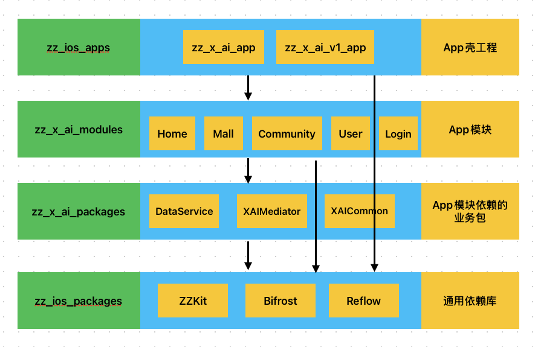

# ios_pod_modules

## 模块化思路

[Bifrost](https://tech.youzan.com/you-zan-ioszu-jian-hua-jia-gou-she-ji-shi-jian/)  模块化解决方案

iOS模块化方案，主要是通过解决多个模块之间的耦合实现，此工程依赖 Bifrost 这个框架实现模块之间的非直接通信，主要包含三个主要功能。

1. 服务注册 ： 通过定义模块协议，注册到Bifrost，实现不同模块之间的方法调用
2. 路由服务： 通过注册路由（即路径字符串），实现不同模块之间的调用，适合页面跳转场景
3. 消息转发： 只需要知道实例对象的方法名就能实现调用，无需引入头文件，缺点是没有类型和编译判断，难以找问题和维护。

所以通常就采用上面两种方案结合使用，达到组件化的目的。

## 模块化具体实现

1. 通过分包实现物理隔离，避免业务开发在同一个工程的时候随意引用头文件，造成混乱导致单一功能的模块难以剥离
2. 架构总共分为四层，同一层原则上不允许横向依赖，每个模块符合单一职责原则。
   - 第一层App壳工程： 程序入口，负责组装App需要的模块。
   - 第二层App业务模块： 具体的UI界面，交互逻辑实现，不同模块可以随意被壳工程组合实现快速复用，也可以轻松被移除。
   - 第三层App业务包： 主要负责数据，不同业务模块之间的通信。
   - 第三层通用依赖库： 通用依赖库是复用程度最高的，因为不包含业务逻辑。

