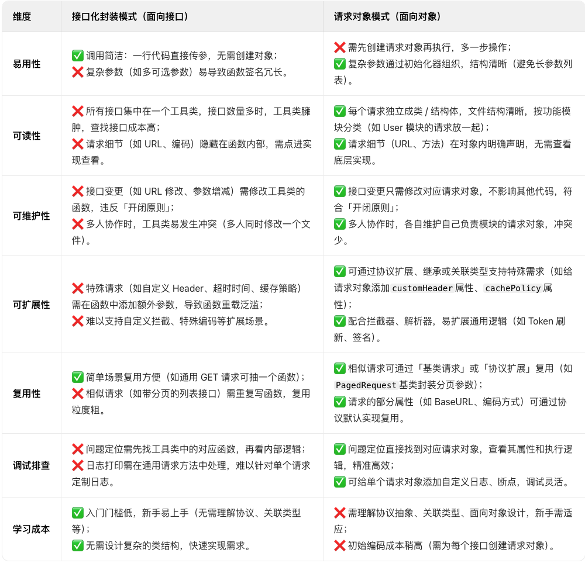
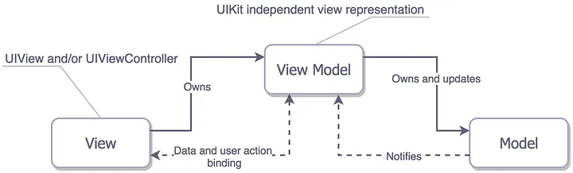
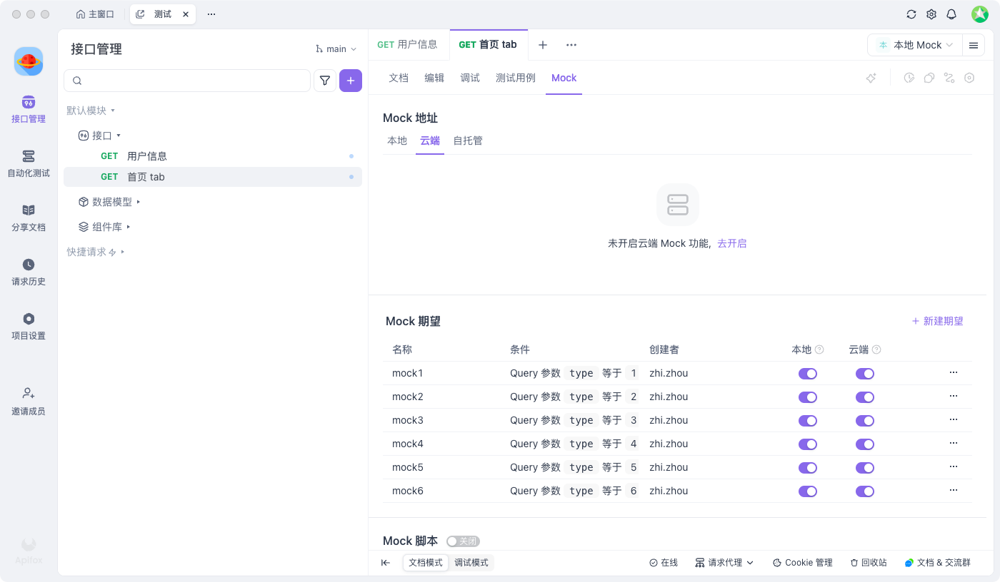

# ios_pod_modules


## 模块化思路

[Bifrost](https://tech.youzan.com/you-zan-ioszu-jian-hua-jia-gou-she-ji-shi-jian/)  模块化解决方案

iOS模块化方案，主要是通过解决多个模块之间的耦合实现，此工程依赖 Bifrost 这个框架实现模块之间的非直接通信，主要包含三个主要功能。

1. 服务注册 ： 通过定义模块协议，注册到Bifrost，实现不同模块之间的方法调用
2. 路由服务： 通过注册路由（即路径字符串），实现不同模块之间的调用，适合页面跳转场景
3. 消息转发： 只需要知道实例对象的方法名就能实现调用，无需引入头文件，缺点是没有类型和编译判断，难以找问题和维护。

所以通常就采用上面两种方案结合使用，达到模块化的目的。


## 模块化具体实现


1. 通过分包实现物理隔离，避免业务开发在同一个工程的时候随意引用头文件，造成混乱导致单一功能的模块难以剥离
2. 架构总共分为四层，同一层原则上不允许横向依赖，每个模块符合单一职责原则。
   - 第一层App壳工程： 程序入口，负责组装App需要的模块。
   - 第二层App业务模块： 具体的UI界面，交互逻辑实现，不同模块可以随意被壳工程组合实现快速复用，也可以轻松被移除。
   - 第三层App业务包： 主要负责数据，不同业务模块之间的通信。
   - 第三层通用依赖库： 通用依赖库是复用程度最高的，因为不包含业务逻辑。


## 网络架构

**核心：使用命令模式，把每个请求封装成一个独立对象，每个请求的业务逻辑自己处理，实现百分百的自控，而不用每次修改接口都需要去修改网络管理类**。

- 具体参考DataService包




## MVVM

- `Model` 对应特定的接口数据模型
- `View`  /`Controller`  负责UI布局、生命周期 ，监听ViewModel 状态并更新UI
- `ViewModel` 负责处理数据，Service，提供数据，处理view的交互事件
- `Service`  网络服务、数据服务、或者特定的业务服务
- `UIModel`  对应特定的UI数据模型

1. 持有关系: MVVM中View和Controller归类为View、View -> ViewModel -> Model/Service。
2. 数据流向: Model/Service -> ViewModel -> View、ViewModel 可以通过block、代理、或者绑定框架更新View
3. 动作流向: View -> ViewModel -> Model/Service
4. ViewModel不能持有View、Model/Service不能持有ViewModel、View和Model互不知道/互不持有
5. View在需要复杂数据时可以创建对应的UI专属Model，避免直接使用业务Model(数据模型)，UI Model由ViewModel创建并管理





## 状态管理


[Reflow](https://github.com/Zepo/Reflow) 一个受 Flux架构、Redux 和 Vuex 启发的 Objective-C 单向数据流框架


- **状态**：驱动整个应用的数据源；
- **视图**：对**状态**的UI映射；
- **交互**：状态根据用户在**视图**中的输入而作出相应变更的可能方式


下面是“单向数据流”这一概念的简单图示：


然而，当我们有**多个组件共享一个共同的状态**时，就没有这么简单了：

1. 多个视图（跨页面、跨模块）可能都依赖于同一份状态。
2. 来自不同视图的交互也可能需要更改同一份状态。

一个可行的办法是将共享状态“提升”到共同的祖先组件上去，再通过参数传递下来。然而在深层次的组件树结构中这么做的话，很快就会使得代码变得繁琐冗长。

一个更简单直接的解决方案是抽取出组件间的共享状态，放在一个全局单例中来管理。这样我们的组件树就变成了一个大的“视图”，而任何位置上的组件都可以访问其中的状态或触发动作。


## mock数据

- Apifox mock数据




- 数据结构

```
{
    "response_status": {
        "status": 0,
        "msg": "est sunt adipisicing"
    },
    "response_data": {
        "tabs": [
            {
                "id": "1",
                "name": "热门1",
            },
             {
                "id": "2",
                "name": "热门2",
            },
             {
                "id": "3",
                "name": "热门3",
            },
            {
                "id": "4",
                "name": "热门4",
            },
             {
                "id": "5",
                "name": "热门5",
            },
             {
                "id": "6",
                "name": "热门6",
            },
            {
                "id": "7",
                "name": "热门7",
            },
             {
                "id": "8",
                "name": "热门8",
            },
             {
                "id": "9",
                "name": "热门9",
            },
            {
                "id": "10",
                "name": "热门10",
            },
             {
                "id": "11",
                "name": "热门11",
            },
             {
                "id": "12",
                "name": "热门12",
            },
            {
                "id": "13",
                "name": "热门13",
            },
             {
                "id": "14",
                "name": "热门14",
            },
             {
                "id": "15",
                "name": "热门15",
            },
        ]

    }
}
```

